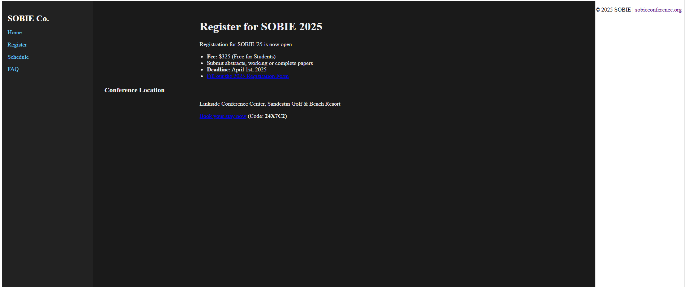

# 🐝 Sobie Co. Dev Enhancement —  Layout and Gist

## 🎯 Summary
**Author:** [LMoats11](https://github.com/LMoats11) 
This sub-issue enhances the Sobie Co. staging site by improving the user layout experience. I focused on **ease of use and quality of life**, adding:

- 🟩 A sidebar navigation panel
- 🟩 A "What's New" banner
- 🟩 Responsive layout
- 🟩 Countdown to the next conference
- 🟩 Page Search Bar

---


## 🔗 Links

| Item                | Link |
|---------------------|------
| 🐝 Staging Repo     | https://github.com/barrycumbie/theSobieCo |
| 🤠 My Fork          | https://github.com/LMoats11/theSobieCo |
| 🌐 VsCode           | https://lmoats11.github.io/theSobieCo/ 
| 🐝 Sub-Issue        | https://github.com/barrycumbie/theSobieCo/issues/20 |
| 🤠 Feature Branch   | `https://github.com/LMoats11/theSobieCo/tree/Sobie_Cowboy` |
| 📁 Folder/Path      | `/index.html`, `/style.css`, `/script.js`, `/faq.html`, `/register.html`, `/schedule.html`, `/sidebar.html`, `footer.html`, `sources`  |

---

## 📸 Screenshots

| 🔴 BEFORE | 🟩 AFTER |
|----------|---------|
|  |  |

---

## 💡 Why This Matters

- Users want to **know what's new**, **where to go**, and **how to orient themselves**.
- Contextual navigation reduces cognitive load.
- Personalized UI builds trust and relevance.

---

## 🧪 Testing Strategy

### ✅ 1. Visual Inspection (UI Testing)
- **Goal:** Ensure layout consistency and design across all pages.
- **Manual Checklist:**
  - [x] Sidebar appears and functions on every page.
  - [x] Footer is properly aligned at the bottom.
  - [x] “What’s New” banner is visible at the top.
  - [x] Countdown card is styled and positioned correctly.
  - [x] Color scheme (seafoam green + light grey) is consistent across all components.
  - [x] Card styling (padding, shadow, border-radius) appears correct.

---

### 🧪 2. Functional Testing

#### Dynamic Sidebar & Footer Injection
- Confirm `sidebar.html` and `footer.html` load via JavaScript `fetch()`:
  - [x] No JS console errors.
  - [x] Elements are populated and interactable on load.
- Fallback Behavior:
  - [ ] Graceful UI fallback when JavaScript is disabled.

#### Search Bar
- Filters visible content dynamically across `.main`, `.container`, and `.card` sections.
- Test Cases:
  - [x] Case insensitive (e.g., `SOBIE` vs `sobie`)
  - [x] Search reset (clearing input restores all content)

#### Countdown Timer
- JavaScript countdown updates every second.
- When event is in the future:
  - [x] Displays `X Days, Y Hours, Z Minutes, W Seconds` remaining.
- When event has passed:
  - [x] Displays `The conference has started!`
- Refresh page to confirm persistence and correct reinitialization.

---

### 🔃 3. GitHub Pages Testing
- **Branch:** `Sobie_Cowboy`
- **Live URL:** [`https://LMoats11.github.io/theSobieCo/`](https://LMoats11.github.io/theSobieCo/)
- Confirm:
  - All components load and behave correctly.
  - Countdown remains functional after deployment.
  - Search works client-side only (no server needed).
  - Mobile and desktop layouts are preserved.

---

### ⚠️ 4. Console + Error Logging
- Open browser dev tools (F12 > Console tab)
- Confirm no fetch or JS errors:
  ```js
  Error loading sidebar: ...
  Error loading footer: ...
 ---

### ✅ Local Dev
```bash
git clone https://github.com/LMoats11/theSobieCo
cd theSobieCo
git checkout Sobie_Cowboy
open index.html
```

### Samples
(screenshots/sample1.png)
(screenshots/sample2.png)
